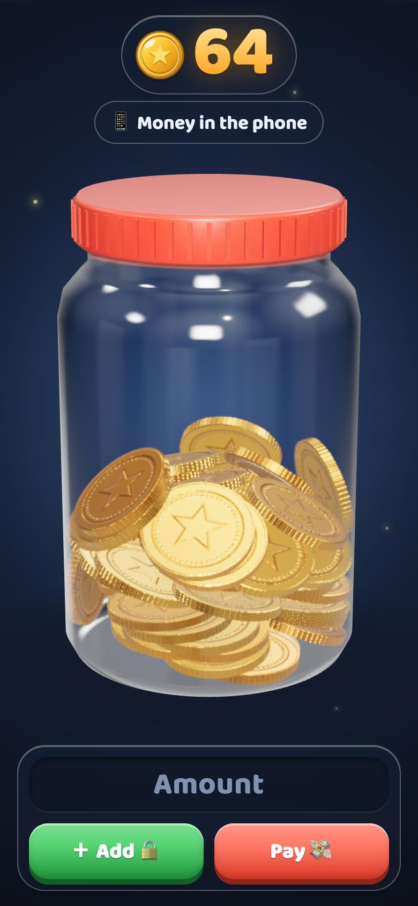
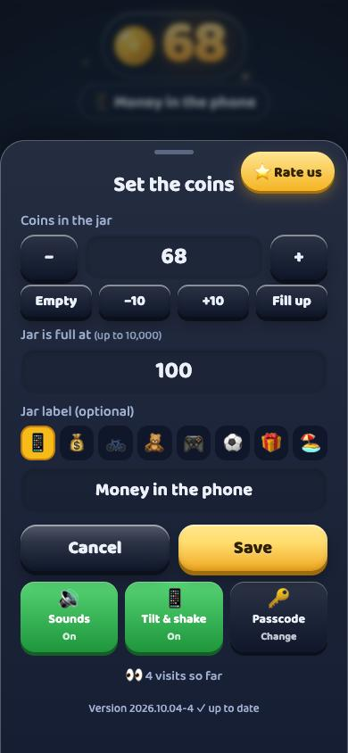

<p align="center">
  
</p>

<h1 align="center">Mobile Coin Jar</h1>

<p align="center">
  <b>Kids see us pay with a tap and think the phone is full of money.<br>
  This jar shows them how much is really left.</b>
</p>

<p align="center">
  <a href="https://surajjbv.github.io/mobile-coin-jar/"></a>
</p>

<p align="center">
  
  
  
  
</p>

<p align="center">
  &nbsp;
  &nbsp;
  
</p>
<p align="center"><sub>The jar &nbsp;·&nbsp; Money in: the office man deposits it &nbsp;·&nbsp; Money out: coins fly away</sub></p>

## 💡 Why

With cash, children could watch the wallet get thinner. With tap-to-pay, money is invisible.
I built this for my 5-year-old so he can **see** money coming in from work and going out when we spend.

## 🪙 How it works

<table>
  <tr>
    <td align="center" width="33%"><h3>💼</h3><b>Money comes in</b><br><sub>An office man walks in, knocks on the lid and pours coins into the jar</sub></td>
    <td align="center" width="33%"><h3>💸</h3><b>We spend</b><br><sub>Type the amount, tap <b>Pay</b>, and watch the coins fly out</sub></td>
    <td align="center" width="33%"><h3>🔴 🟠 🟢</h3><b>How much is left</b><br><sub>The number turns red when the jar is running low</sub></td>
  </tr>
</table>

Kids can tilt and shake the phone to rattle the coins. Only grown-ups can add money (a 4-digit passcode).

## 📲 Get it on your phone

<table>
  <tr>
    <td align="center" width="50%"><b>🍎 iPhone</b><br><sub>Open the link in <b>Safari</b> → <b>Share</b> → <b>Add to Home Screen</b></sub></td>
    <td align="center" width="50%"><b>🤖 Android</b><br><sub>Open the link in <b>Chrome</b> → <b>⋮</b> → <b>Install app</b></sub></td>
  </tr>
</table>

First time: triple-tap the number, set a passcode, and enter how many coins you have.
Forgot the passcode? Tap **Forgot passcode?**, answer two quick sums, and choose a new one. Your coins are kept.

<p align="center"><br><sub>The grown-ups menu</sub></p>

## 🔒 Private by design

No accounts, no ads, no cookies. Coins and passcode stay on the phone. Only an anonymous visit count and
optional feedback ever leave it.

<details>
<summary><b>🛠️ For developers</b></summary>

<br>

<p>
  
  
  
</p>

- **Single `index.html`, no build step.** three.js and Rapier (WebAssembly) load from jsDelivr through an import map.
- **3D:** physically based glass and metal coins with procedural textures; every coin is a physics body, and gravity
  follows the phone's accelerometer. Up to 10,000 coins: the bottom of big piles is a packed, GPU-instanced mass with
  physics coins on top.
- **The deposit film** is directed in code: camera shots, two-bone IK for the arms, spring-based animation principles
  (anticipation, follow-through, squash & stretch), bloom and depth of field.
- **Installable PWA** with an offline service worker; hosted on GitHub Pages; the app checks `version.json` for updates.
- **Privacy-friendly extras:** [GoatCounter](https://www.goatcounter.com/) visit counts (no cookies) and
  [Web3Forms](https://web3forms.com/) feedback by email.
- **Release notes:** [CHANGELOG.md](CHANGELOG.md).

**Run locally**

```bash
python3 -m http.server 8000
```

**Check before pushing** (GitHub Pages serves `main` as it is)

```bash
npm test   # versions agree, offline files exist, cached library versions match the page, scripts parse
```

**Credits:** coin sounds from [CreatorAssets](https://creatorassets.com/audio/coins-clink/) (CC0) · the office man is
[Business Man](https://poly.pizza/m/JFrLIKqvCH) by Quaternius (CC0) · button and card styles inspired by
[uiverse.io](https://uiverse.io/). · License: MIT.

</details>
